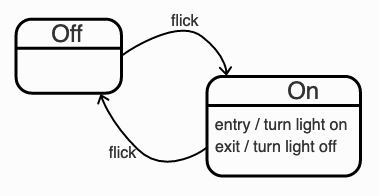

# Statinator

[![CI/CD][ico-actions]][link-actions]

Next-gen PHP state machines and state charts.

## Installation

`composer require jeroen-g/statinator`

## Usage

Imagine you want to create a state machine for a light switch in which the light can be in the state ON or OFF.
A diagram would look as follows:



_Source: [statecharts.github.io](https://statecharts.github.io/)_

The Statinator configuration for this state machine would look like this:

```php
$config = [
    'states' => [
      'LIGHTS_ON',
      'LIGHTS_OFF',
    ],
    'transitions' => [
        'FLICK_ON' => [
            'from' => ['LIGHTS_OFF'],
            'to' => ['LIGHTS_ON'],
        ],
        'FLICK_OFF' => [
            'from' => ['LIGHTS_ON'],
            'to' => ['LIGHTS_OFF'],
        ],
    ],
];
```

Then in your application you should instantiate Statinator with this configuration.

```php
use JeroenG\Statinator\Statinator;
$statinator = new Statinator($config);
```

The Statinator accepts a second parameter as a repository implementing the `ActionRepositoryInterface`,
this (optionally) stores successful and failed actions.

Any object that you want to use with a state machine should implement the `StatableInterface` contract.
For the example of the light switch this might be:

```php
use JeroenG\Statinator\StatableInterface;

class LightSwitch implements StatableInterface {
    private string $currentState;

    public function __construct(string $initialState)
    {
        $this->currentState = $initialState;
    }

    public function getState(): string
    {
        return $this->currentState;
    }

    public function setState(string $to): void
    {
        $this->currentState = $to;
    }
}
```

Anywhere in your code, you may use the Statinator instance to get a state machine and interact with its state and transitions.

```php
$lightSwitch = new LightSwitch('LIGHTS_OFF');
$sm = $statinator->get($lightSwitch);

$sm->getState(); // LIGHTS_OFF
$sm->can('FLICK_ON'); // true
$sm->can('FLICK_OFF'); // false

$sm->apply('FLICK_ON');

$sm->getState(); // LIGHTS_ON
$sm->can('FLICK_ON'); // false
$sm->can('FLICK_OFF'); // true
```

While seeing objects move from one state to another is quite cool, the real power lies with the actions that you may define
for transitions.

Before and after a state changes, the state machine executes any available actions. You can define actions as part of the
global configuration, or by using a setter on the Statinator.

```php
// Using the configuration
$config = [
    // ...
    'transitions' => [
        'FLICK_ON' => [
            'from' => ['LIGHTS_OFF'],
            'to' => ['LIGHTS_ON'],
            'on' => [
                'entry' => NotifyLightsAreOn::class,
                'exit' => NotifyLightsAreOff::class,
            ],
        ],
    // ...
    ],
];

// Or using a setter
$statinator->onEntry('FLICK_ON', NotifyLightsAreOn::class);
$statinator->onExit('FLICK_ON', NotifyLightsAreOff::class);
```

The actions can be a `callable` or a class implementing `ActionableInterface`.

```php
$statinator->onEntry('FLICK_OFF', fn(StateMachineInterface $stateMachine, string $transition) => var_dump('Called it!'));
````

```php
use JeroenG\Statinator\ActionableInterface;
use JeroenG\Statinator\StateMachineInterface;

class NotifyLightsAreOn implements ActionableInterface {
    private StateMachineInterface $stateMachine;
    private string $transition;

    public function getState(): string
    {
        return $this->stateMachine->getState();
    }

    public function execute(StateMachineInterface $stateMachine, string $transition): void
    {
        $this->stateMachine = $stateMachine;
        $this->transition = $transition;

        $notifier = new MyNotifier();
        $notifier->send('Lights are turned on');
    }

    public function getTransition(): string
    {
        return $this->transition;
    }
}
```

If your action implements the `ActionableInterface` it could be saved using a repository that is passed when you instantiated Statinator.
This package ships with an `ArrayActionRepository` that is used by default and does not persist the data. Another possibility
is the `LogActionRepository`, this one requires a PSR-compliant logger where the data will be persisted.
You can of course also make your own repository (maybe one that uses the database) as long as it implements the `ActionRepositoryInterface`.

## Contributing

The project includes a Makefile to run install it, run the tests and check the code style.


[link-actions]: https://github.com/Jeroen-G/alpine-artisan/actions?query=workflow%3ACI%2FCD
[ico-actions]: https://img.shields.io/github/workflow/status/Jeroen-G/alpine-artisan/CI?label=CI%2FCD&style=flat-square
